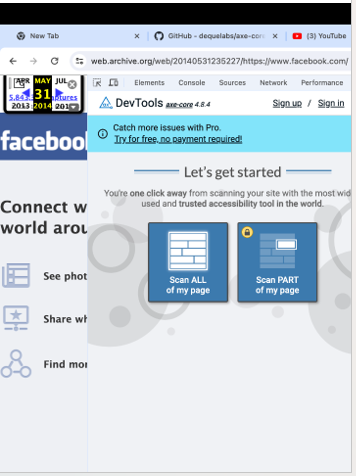

# Independent Study 

## Team  Members

Abhinav Varma Lakamraju : alaka003@odu.edu

Tanishq Motupalli : tmotu001@odu.edu 

Ramesh Kumar Bacchu : rbacc001@odu.edu

.

## CS 795 TPCS: INTELLIG INTERACTIVE SYS

## Accessibility Unlocked: Enhancing Web Usability with AXE DevTools and LLMs
## Introduction : 
The objective of this project is to identify and categorize accessibility issues in web-archived data across a variety of categories, using AXE DevTools Chrome Extension. Given the importance of web accessibility, ensuring archived websites meet accessibility standards is crucial for inclusivity and legal compliance. This project aims to analyze archived websites, detect accessibility errors, and organize the results in a structured manner. Accessibility on the web ensures that all users, including those with disabilities, can navigate and interact with websites. The Web Content Accessibility Guidelines (WCAG) are the industry standard for web accessibility, covering a range of requirements to make websites usable for people with disabilities. Deque Systems' Axe DevTools is a tool designed to identify accessibility issues in websites. By analyzing archived websites with Axe DevTools, we can pinpoint areas where older websites may fall short of current accessibility standards.
Blind individuals often face significant challenges when navigating the web, especially when revisiting past web content. This project aims to explore the potential of Large Language Models (LLMs) to improve accessibility for blind users and understand their preferences, challenges, and needs. We seek to evaluate how conversational AI systems and LLMs can be adapted to assist blind individuals in accessing web archives and finding reliable information. Moreover, Blind users rely heavily on assistive technologies like screen readers and voice assistants for accessing web content. However, these technologies often fall short in providing seamless navigation, especially with older or complex web content. As LLMs become more advanced, they could offer a more user-friendly and intuitive approach for blind users to access information and improve their well-being.
Evaluate web pages within a three-hop distance from the home page on Archive.Today and Trova .

we have conducted analyses on each hop from both Archive. Today. Exporting the data generated by IBM Equal Accessibility Checker, WAVE tool ,AI Inspector and storing it neatly in Excel files. After understanding the structure and content of the web pages on Archive. Today and Trove, the next step is to conduct an analysis to check if the identified issues were present across different web archives. These archives could include the Wayback Machine, UK Web
Archive, Trove, Pandora, and Archive. Today. This analysis involves comparing the same web pages across different archives to identify any discrepancies or issues.
Once the analysis is complete, the results need to be documented in form of excel. This involves writing a detailed report that outlines the methodology used for the analysis, the findings, and any conclusions or recommendations. The report should be written in a clear oand concise manner, making it easy for others to understand the work that has been done.

Methodology
## Data Collection
The project involved selecting archived websites across a wide range of categories. We used the Web Archive platform to access these archived websites and generate accessibility reports with the Axe DevTools Chrome Extension. The websites were chosen based on popularity and user count, ensuring a diverse and comprehensive dataset.
We ran a study with 14 blind people to learn about their experiences with conversational AI and their needs when going back to old web content. First, we collected some basic information about them. Then, we talked to them about Large Language Models (LLMs) and asked what they thought about chatbots and other AI systems—what they liked, what problems they faced, and how they thought things could be better.
To understand how they navigate old web content, we asked them questions about what they need when revisiting past websites. We also asked about the types of content they found most helpful and the tools they used. These answers will help us see how LLMs can make things easier and better for blind users.
Research Approach
To address the problem statement, we conducted a user study with blind participants, aiming to collect insights on their interaction with LLMs and how they access past web content. The study was divided into two parts: conversational AI and web archive interactions. We designed questions to gather information about their experiences, preferences, challenges, and suggestions for improvement.
## Categorization
To maintain consistency, we categorized the websites into 24 distinct categories, each containing 50 websites. This categorization allowed for a systematic approach to data collection and analysis. The categories included:
●	Arts Entertainment

●	Business and Consumer Services

●	Community and Society

●	Computers, Electronics, and Technology

●	E-commerce and Shipping

●	Education

●	Finance

●	Food and Drinks

●	Gambling

●	Games

●	Government

●	Heavy Industry and Engineering

●	Hobbies and Leisure

●	Home and Garden

●	Jobs and Careers

●	Law and Government

●	Lifestyle

●	News and Media Publishers

●	Pets and Animals

●	Reference Materials

●	Science and Education

●	Sports

●	Travel and Tourism

●	Vehicles

 
## Accessibility Analysis
●	For each archived website, we used the Axe DevTools Chrome Extension to conduct accessibility tests. 

●	The tool generates a detailed JSON report containing information about accessibility issues, including the location of the problem on the website, applicable WCAG rules, and recommended solutions. 

●	We generated over 27,000 JSON files representing these accessibility reports.

●	We transcribed the recorded conversations and categorized the responses to identify common themes and insights.

●	We analyzed the data to understand the blind users' experiences with LLMs and their requirements for accessing past web content.

●	We documented the findings to create a comprehensive case study on the interactions with LLMs and web archive

 

## Implementation Details
# Evaluate web pages within a three-hop distance from the home page on Archive. Today and Trova 

So, we started things off by exploring web pages on Archive.today and Trove, just a few hops away from their main pages. Our toolkit included WAVE, IBM Equal Accessibility Checker, and AI Inspector. 

First things first, we took a good look at both Archive.today and Trove websites to get a sense of what's happening in those pages. Then, we got down to using the WAVE tool to gather data for each hop. We did this for 30 hops on Archive.today and another 30 on Trove, all with  WAVE tool. 

To keep things organized, we created a document and inserted screenshots of those 30 hops from both Archive.today and Trove. These screenshots give us a visual breakdown of each hop along with a summary and details. 

Moving on, we didn't stop at WAVE and we brought in two more tools - IBM Equal Accessibility Checker and AI Inspector. We ran these on each hop from both Trove and Archive.today. we exported the files and neatly stored the data in Excel files. 

Our document also did some detective work, identifying issues and jotting them down in an Excel sheet, noting how often they appeared. We took it a step further and checked if these issues were hanging out across different web archives like Wayback Machine, UK Web Archive, Trove, Pandora, and Archive.today. 

All in all, it was a journey through web pages, tools, and data, and now we've got the insights neatly laid out for review. 
After generating the JSON files, we organized them by category and website. Each JSON file was renamed to represent the year of the archived data. This systematic approach facilitated easy access to specific datasets for analysis and comparison.
The Axe DevTools Chrome Extension identifies accessibility issues with 100% certainty, reducing false positives. The JSON files were downloaded for each website, allowing further research and data manipulation. By generating accessibility reports, we ensured that each archived website's accessibility issues were identified, documented, and made available for further research and improvement.
Challenges Encountered
One of the challenges encountered was accessing archived websites with varying levels of responsiveness and loading times. Additionally, some older websites lacked compatibility with modern testing tools, requiring adjustments in the data collection process. We addressed these challenges by using a flexible testing approach, ensuring consistent results.
Conversational AI with LLMs

●	We provided a brief explanation of LLMs to the participants, describing them as advanced chatbots that can understand and respond to questions.

●	We asked a series of questions about their interactions with conversational AI, focusing on trust, human-like qualities, needs, and concerns regarding biases and stereotypes.

## Web Archive Navigation
●	We explored how blind users access past web content and the tools they use, focusing on screen readers and voice assistants.

●	We asked questions about the types of content they found most valuable and informative, their preferred devices for accessing past content, and the features or tools they found most helpful.

●	We addressed challenges and barriers faced by blind users when revisiting past web content, including usability, accessibility, and security.

The Topic wise questions asked to the blind people. 
Web Archive
1. What specific types of web content, such as news, entertainment, sports, politics, science, and technology, do you find most valuable or informative when revisiting past content?
2. When accessing past web content, what information or knowledge do you typically seek, and why is this information important to you?
3. Do you believe it's necessary to save past web content, including news, entertainment, politics, technology, advertisements, etc.? If so, why?
4. How do you prefer to access past web content: via computer or mobile device?
5. When accessing past web content, do you prefer to navigate using a screen reader or engage in conversation-style interaction, such as chatting with a chatbot?
6. What features or tools do you find most helpful when accessing past web content?
7. Do you encounter challenges or barriers when trying to access past web content, and if so, what are these challenges?
8. How do you prefer to organize or categorize past web content for easier retrieval?
9. Are there specific accessibility features or standards that you expect when accessing past web content?
10. How do you perceive the reliability and credibility of past web content, and what measures do you take to ensure the accuracy of the information you access?
11. How frequently do you revisit past web content, and what factors influence your decision to revisit certain content?
12. Are there specific timeframes or periods of interest for you when accessing past web content (e.g., recent events, historical context)?
13. What types of multimedia content (e.g., audio, video, images) do you find most valuable when accessing past web content?
14. Do you engage with user-generated content, such as comments or forums, when revisiting past web content, and if so, how do you navigate and interact with this content?
15. How do you evaluate the usability and accessibility of websites when accessing past web content, and what improvements do you suggest?
16. Are there particular search or browsing functionalities that you prefer when accessing past web content?
17. How do you perceive the privacy and security implications of accessing past web content, especially in cases where personal information may be involved?
18. Do you rely on specific assistive technologies or software applications to access past web content, and if so, what are your preferences?
19. What role do social media platforms play in your interactions with past web content, and how do you navigate and engage with content shared on these platforms?
20. How do you prioritize and manage your time when accessing past web content, especially considering potential distractions or overwhelming amounts of information?
  

# LLM:
1.	What are your experiences interacting with conversational AI systems or chatbots? What has worked well or not worked well for you?
2.	What qualities would make you feel like you could trust this system? What might decrease your trust?
3.	How human-like would you want a system to be for you to feel comfortable conversing with it openly? In what ways should it seem human or not?
4.	What types of needs or challenges in your life do you think this type of system could potentially help with? How could it provide meaningful assistance?
5.	How might an AI model thoughtfully engage with and discuss visual impairment or blindness in your conversations?
6.	What concerns do you have about biases or stereotypes that a large language model AI might exhibit regarding visual impairment or blindness?
7.	How could an AI system be designed to help you make social connections and feel less alone?
8.	Do you think AI systems should be transparent about the fact that they are not humans? Why or why not?
9.	In what ways might a large language AI system fail to meet your needs or expectations? How could they better align with your community's values and preferences?
10.	What advice would you give the developers of AI systems to make them more inclusive, empowering, and beneficial for you?

Challenges and Solutions
●	One major challenge was ensuring that the questions were accessible and understandable for blind participants. We mitigated this by conducting audio-based interviews and using screen readers for communication.
●	Another challenge was ensuring the participants' privacy and confidentiality, which was addressed through informed consent and secure data storage.
## Results
# Analysis Results
The analysis revealed a range of accessibility issues across the categories. Common issues included:
●	Missing alternative text for images

●	Inaccessible forms and buttons

●	Insufficient color contrast

●	Problems with keyboard navigation

●	Inconsistent use of semantic HTML

These issues varied across different categories, with some experiencing more accessibility problems than others.
## Conversational AI with LLMs
●	Most participants had limited experience with conversational AI systems. Those who used them highlighted issues with inconsistent responses and lack of context.

●	Participants valued qualities like transparency, reliability, and a certain level of human-like interaction for trust and comfort.

●	They believed LLMs could help with information retrieval, navigation assistance, and providing social connection.
Web Archive Navigation.

●	Screen readers were the most common tool for accessing past web content. Voice assistants were less reliable due to their difficulty in understanding context.

●	Challenges included outdated information, complex navigation, and missing accessibility features on websites.

●	Participants expressed a preference for computer-based access over mobile devices, indicating that more complex tasks required a desktop environment.

## Limitations and Areas for Improvement
●	The analysis was limited to the archived versions of websites, which may not represent their current state. 

●	Additionally, some archived websites had limited interactivity, impacting the depth of analysis. 

●	Future work could focus on testing live websites or expanding the scope to cover additional accessibility standards.

●	One limitation was the relatively small sample size, which might not represent the broader blind community.

●	The study highlighted the need for more adaptive and context-aware tools to improve navigation and reduce accessibility barriers.

## Conclusion and Future Work
## Key Findings and Achievements
This project successfully identified accessibility issues across a wide range of archived websites, categorizing the results for easy access and analysis. The use of Axe DevTools Chrome Extension provided reliable and accurate accessibility testing, offering actionable insights into accessibility improvements.
The user study offered valuable insights into the experiences of blind users with Large Language Models (LLMs) and navigating web archives. While screen readers continue to be the most effective tool for these users, LLMs have the potential to significantly improve accessibility by providing conversational and context-aware interactions. To realize this potential, LLMs must be designed with a focus on trust, transparency, and adaptability. By integrating these elements, LLMs can enhance the experience for blind users, complementing existing tools like screen readers to create a more user-friendly and accessible web environment.
Potential Future Directions
## Future work could involve:
●	Extending the analysis to live websites for a more comprehensive view of accessibility.

●	Automating the data collection and analysis process for increased efficiency.

●	Exploring additional accessibility standards and tools to gain a broader perspective.

●	Collaborating with website owners to address and resolve identified accessibility issues.

●	Future work could involve developing a prototype LLM system designed specifically for blind users, integrating voice and screen reader capabilities.

●	Further research with a larger sample size and more diverse demographic backgrounds could provide additional insights.

●	Collaboration with accessibility experts and blind user groups can help refine the design and implementation of LLM-based systems to better meet their need

